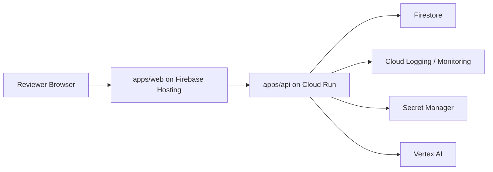
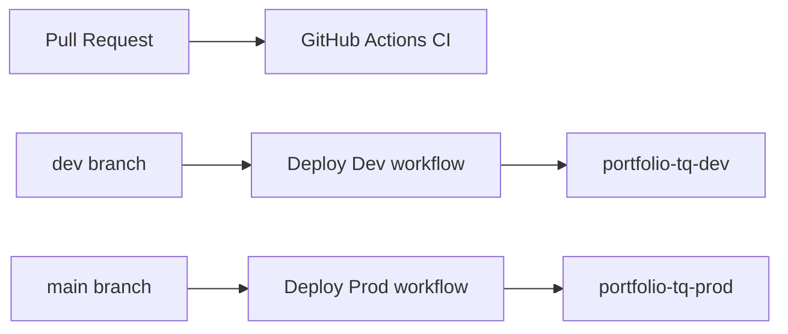
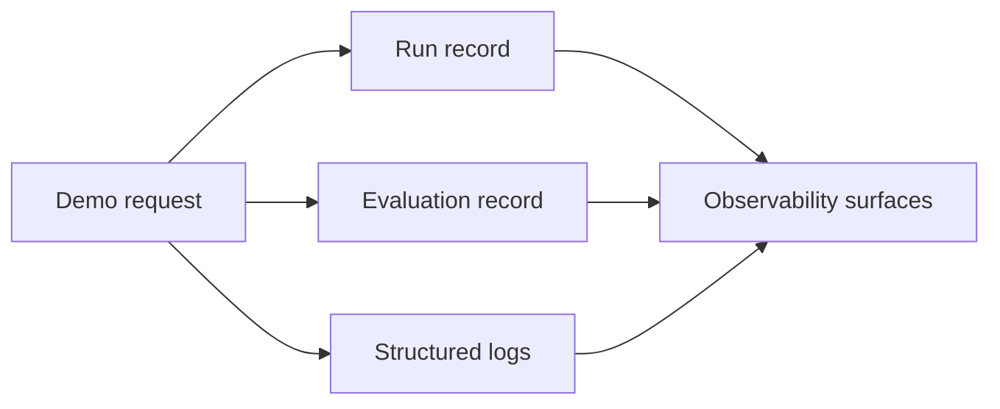

# System Architecture

## High-level diagram (logical)

```txt
[Reviewer Browser]
      |
      v
[apps/web on Firebase Hosting]
      |
      v
[apps/api on Cloud Run]
   |        |         |         |
   |        |         |         |
   v        v         v         v
[Vertex] [Firestore] [Cloud Logging] [Secret Manager]
   |
   v
[shared agent wrapper + project orchestrators]

Seeded synthetic datasets + policy docs are stored in repo/data and loaded into Firestore or served locally during development.
```

## Diagram placeholders to fill in later

These placeholders exist early on purpose so the public repo shows where deeper visuals will land as the system evolves.

### 1. Runtime architecture diagram placeholder



### 2. Delivery pipeline diagram placeholder



### 3. Data and observability diagram placeholder



## Request pattern

1. user opens project page
2. user launches demo
3. web posts to API
4. API creates run record
5. project orchestrator calls tools and model wrapper
6. run/eval data persisted
7. result returned to web
8. observability page reflects latest data

## Cross-cutting concerns

- schemas shared across web/api
- config shared across projects
- traces logged consistently
- evaluation runs for every project
- dashboards consume shared metrics shape
