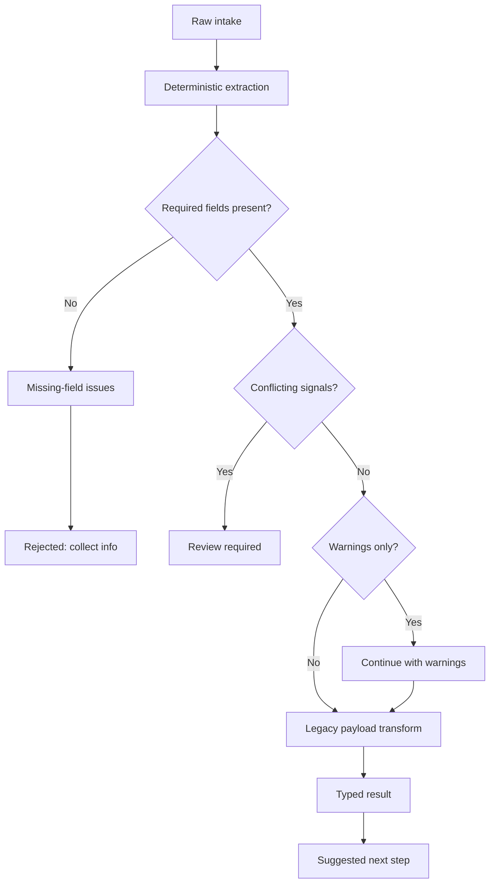

# Demo Page Copy — Legacy Workflow → AI-Native Adapter

## Page header

**Title**
Legacy Workflow → AI-Native Adapter

**Subhead**
Turn messy legacy intake into a clear submission decision. Pick a scenario, run the adapter, and see what would be submitted, rejected, or routed for review.

---

## Input panel

**Section title**
Raw intake

**Field labels**

- Source text
- Optional metadata
- Legacy workflow type

**Primary button**
Run adapter

**Secondary button**
Reset selected case

---

## Extraction panel

**Section title**
Parsed request

**Field labels**

- Extracted fields
- Missing fields
- Validation issues
- Confidence

---

## Legacy payload panel

**Section title**
Legacy payload

**Body**
The exact payload that would be sent to the legacy queue when the request is safe to submit.

---

## Final result panel

**Section title**
Decision

**Field labels**

- Submission status
- Suggested next step
- Review required

---

## Evaluation panel

**Section title**
Review flags

**Metrics**

- Output shape
- Validation result
- Review route
- Response time

---

## Tab: Why I made this.

**I made this because a lot of real systems still expect reality to arrive clean. It rarely does.**

Legacy workflows often assume that the user already knows the right fields, the right structure, and the right format. In practice, people send messy notes, partial details, mixed signals, and incomplete inputs.

This module shows a better approach.

Instead of forcing the user to think like the old system, the adapter absorbs the mess first, extracts what matters, validates it, and only then transforms it into a controlled legacy-compatible structure.

That is the point of the exercise: not replacing discipline, but moving it to the right place.

**What this proves**

- I can design around messy real-world input, not just ideal cases.
- I can combine flexible interpretation with deterministic control.
- I can modernize a workflow without breaking the system it still has to feed.

---

## Tab: How it works.

**The flow is simple on purpose: recover structure, apply control, then transform safely.**

**What actually happens**

1. **Raw intake enters the adapter**
   The input can be incomplete, inconsistent, or loosely written.

2. **The adapter extracts structure**
   It normalizes whitespace, scans for supported workflow signals, normalizes AC-style account IDs, and applies deterministic regex-based extractors for names, ISO dates, USD amounts, target entities, source channel, and request summaries. The result is parsed through the shared Zod extraction schema, with recovered fields, workflow hints, account candidates, and conflict signals preserved for the next stage.

3. **Deterministic validation runs**
   Required fields are checked against the resolved workflow type. Missing required fields stop the run; conflicting workflow hints or multiple account IDs trigger human review; optional field mismatches continue with warnings.

4. **Control logic decides the path**
   The run can proceed, continue with warnings, stop as rejected, or be marked for review before any legacy payload is produced.

5. **A legacy-compatible payload is produced**
   If the input clears the control layer, it is transformed into the older system's expected shape.

6. **A typed final result is returned**
   The output includes the normalized structure, issues, status, and next step.

**The key design choice**
This legacy-to-AI-ready adapter demo is implemented in TypeScript because the portfolio API and web app are TypeScript, but the method itself is not language-specific.

The same system could be built in Python using Pydantic, regex and heuristic extractors, deterministic validation rules, and service-layer tests. The point of this demo is that messy input doesn't need to go straight into heavy, expensive LLM workflow. The better way is to first recover specific candidates from messy text, validate them, and then produce a schema-checked payload. That output is safer, more usable, and far easier to work with in a downstream system, including AI-native ones.
